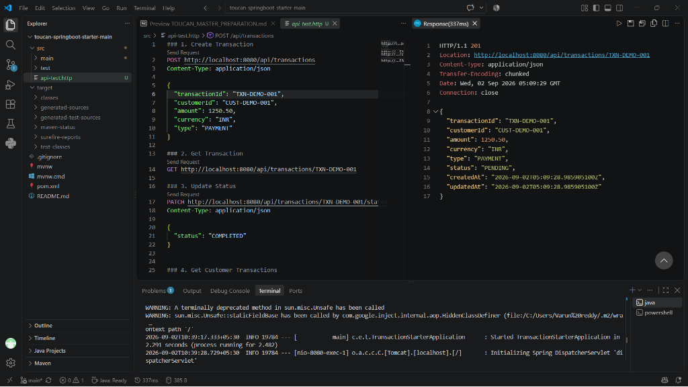
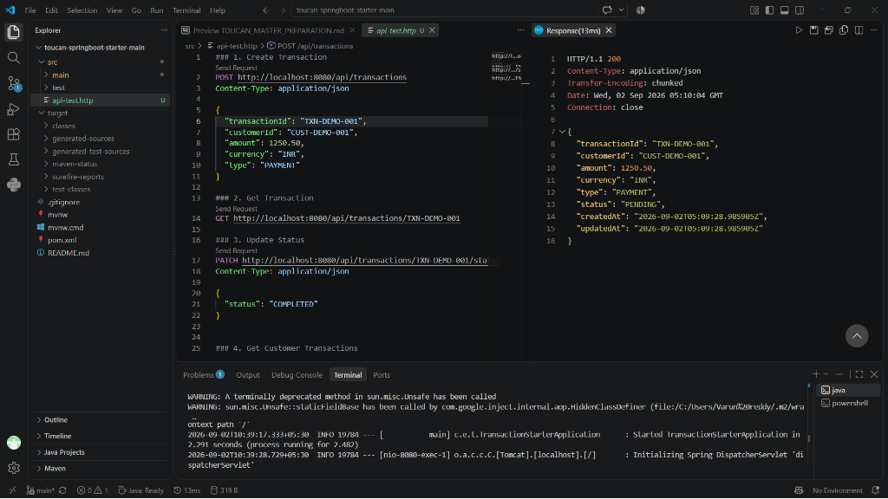
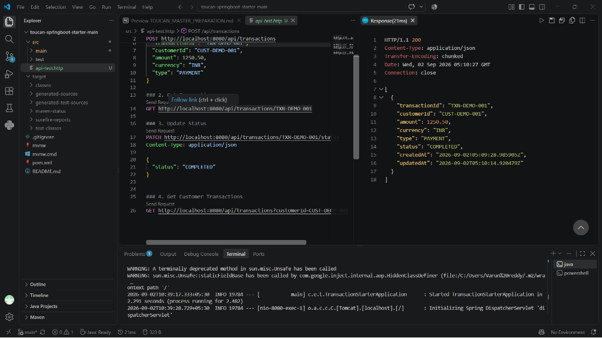
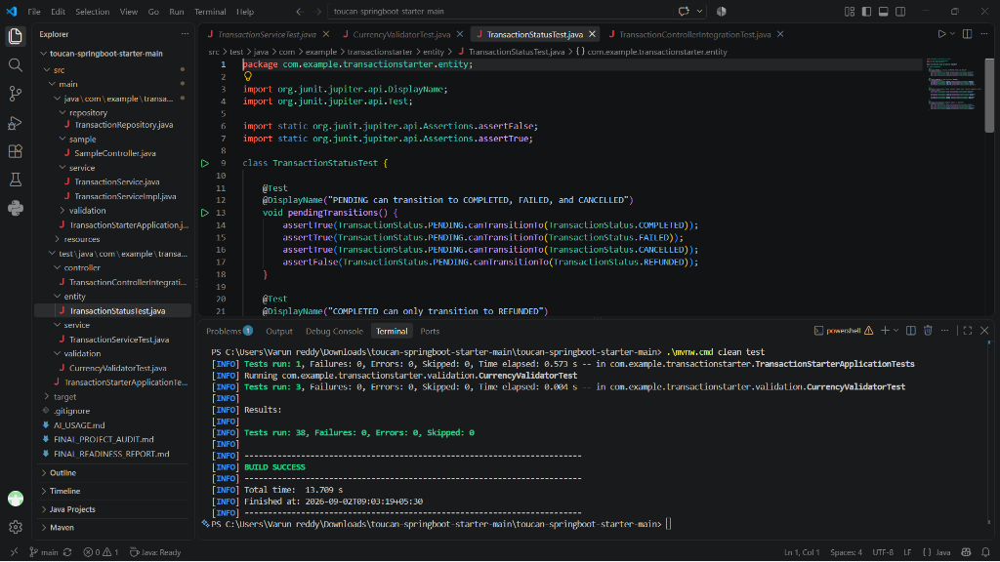
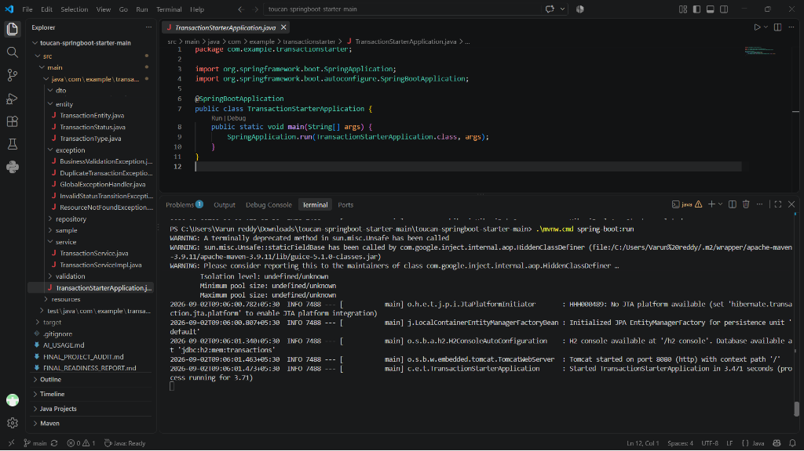

# Toucan Payments — Engineering Challenge
### 2026 Fresher Engineering Trainee Programme — Transaction Processing Service

---

## 1. Problem Understanding & Overview

The objective of this challenge is to build a robust, production-grade transaction processing service using **Java 17**, **Spring Boot 3.5.5**, **Spring Data JPA**, **H2 in-memory database**, and **JUnit 5**.

The service manages the full lifecycle of financial transactions across four primary operations:
1. **Create Transaction**: Accepts, validates, and persists a new transaction while preventing duplicate transaction IDs.
2. **Get Transaction**: Retrieves a single transaction by its unique identifier or returns a descriptive 404 response.
3. **Update Transaction Status**: Updates the lifecycle state of a transaction following a strict, predictable finite state machine.
4. **Get Customer Transactions**: Retrieves transaction history for any given customer ID.

---

## 2. Architecture & Design

The application adheres to clean layered architecture and domain-driven design principles:

```
com.example.transactionstarter
├── TransactionStarterApplication.java       # Spring Boot Application entrypoint
├── controller
│   ├── TransactionController.java          # REST API for the 4 core transaction operations
│   ├── CustomerController.java             # Dedicated customer transaction resource endpoint
│   └── sample/SampleController.java        # Starter sample endpoint preserved
├── dto
│   ├── CreateTransactionRequest.java       # Inbound DTO with Bean Validation constraints
│   ├── UpdateStatusRequest.java            # Inbound DTO for status modification
│   ├── TransactionResponse.java            # Consistent outbound response representation
│   └── ErrorResponse.java                  # Structured error response for API clients
├── entity
│   ├── TransactionEntity.java              # JPA Entity mapped to H2 table 'transactions'
│   ├── TransactionType.java                # Supported types: PAYMENT, DEPOSIT, WITHDRAWAL, REFUND, TRANSFER
│   └── TransactionStatus.java              # State enum: PENDING, COMPLETED, FAILED, CANCELLED, REFUNDED
├── exception
│   ├── ResourceNotFoundException.java      # 404 Not Found
│   ├── DuplicateTransactionException.java   # 409 Conflict
│   ├── InvalidStatusTransitionException.java# 422 Unprocessable Entity
│   ├── BusinessValidationException.java    # 400 Bad Request
│   └── GlobalExceptionHandler.java         # Centralized @RestControllerAdvice exception handler
├── repository
│   └── TransactionRepository.java          # Spring Data JPA repository with indexing & queries
├── service
│   ├── TransactionService.java             # Business service interface
│   └── TransactionServiceImpl.java         # Transactional business logic & state enforcement
└── validation
    ├── ValidCurrency.java                  # Custom Bean Validation constraint for ISO-4217
    └── CurrencyValidator.java              # CurrencyValidator implementation using java.util.Currency
```

---

## 3. The Four Core Operations & API Endpoints

### A. Create Transaction
- **Endpoint**: `POST /api/transactions`
- **Success Status**: `201 Created` with `Location` header
- **Error Statuses**: `400 Bad Request` (validation failure), `409 Conflict` (duplicate `transactionId`)

#### Request Example:
```json
{
  "transactionId": "TX-1001",
  "customerId": "CUST-9001",
  "amount": 149.99,
  "currency": "USD",
  "type": "PAYMENT",
  "status": "PENDING"
}
```

#### Response Example (`201 Created`):
```json
{
  "transactionId": "TX-1001",
  "customerId": "CUST-9001",
  "amount": 149.99,
  "currency": "USD",
  "type": "PAYMENT",
  "status": "PENDING",
  "createdAt": "2026-08-30T19:45:00.000Z",
  "updatedAt": "2026-08-30T19:45:00.000Z"
}
```

> **VS Code Execution (201 Created):**
> 
> 

---

### B. Get Transaction
- **Endpoint**: `GET /api/transactions/{transactionId}`
- **Success Status**: `200 OK`
- **Error Status**: `404 Not Found` (if `transactionId` does not exist)

#### Response Example (`200 OK`):
```json
{
  "transactionId": "TX-1001",
  "customerId": "CUST-9001",
  "amount": 149.99,
  "currency": "USD",
  "type": "PAYMENT",
  "status": "PENDING",
  "createdAt": "2026-08-30T19:45:00.000Z",
  "updatedAt": "2026-08-30T19:45:00.000Z"
}
```

> **VS Code Execution (200 OK):**
> 
> 

---

### C. Update Transaction Status
- **Endpoint**: `PATCH /api/transactions/{transactionId}/status` (or `PUT /api/transactions/{transactionId}/status`)
- **Success Status**: `200 OK`
- **Error Statuses**: `404 Not Found` (non-existent ID), `422 Unprocessable Entity` (illegal status transition), `400 Bad Request` (malformed body)

#### Request Example:
```json
{
  "status": "COMPLETED"
}
```

#### Response Example (`200 OK`):
```json
{
  "transactionId": "TX-1001",
  "customerId": "CUST-9001",
  "amount": 149.99,
  "currency": "USD",
  "type": "PAYMENT",
  "status": "COMPLETED",
  "createdAt": "2026-08-30T19:45:00.000Z",
  "updatedAt": "2026-08-30T19:46:00.000Z"
}
```

---

### D. Get Customer Transactions
- **Primary Endpoint**: `GET /api/transactions?customerId={customerId}`
- **Alternative REST Endpoints**: `GET /api/customers/{customerId}/transactions` or `GET /api/transactions/customer/{customerId}`
- **Success Status**: `200 OK` (returns JSON array of transactions; returns empty array `[]` if customer has no transactions)
- **Error Status**: `400 Bad Request` (if `customerId` is blank/missing on query endpoint)

#### Response Example (`200 OK`):
```json
[
  {
    "transactionId": "TX-1001",
    "customerId": "CUST-9001",
    "amount": 149.99,
    "currency": "USD",
    "type": "PAYMENT",
    "status": "COMPLETED",
    "createdAt": "2026-08-30T19:45:00.000Z",
    "updatedAt": "2026-08-30T19:46:00.000Z"
  }
]
```

> **VS Code Execution (Customer Transactions & Status Update Flow):**
> 
> 

---

## 4. Validation Rules & Domain Design

| Field | Type | Validation Rules | Rationale |
| :--- | :--- | :--- | :--- |
| **Transaction ID** | String | `@NotBlank`, `@Size(max = 64)`, Must be globally unique in database | Uniquely identifies a transaction; prevents double-processing. |
| **Customer ID** | String | `@NotBlank`, `@Size(max = 64)` | Identifies the transacting account holder. |
| **Amount** | BigDecimal | `@NotNull`, `@DecimalMin("0.01")`, `@Digits(integer = 16, fraction = 2)` | Financial transactions must be strictly positive (> 0.00) and conform to standard 2-decimal currency precision. |
| **Currency** | String | `@NotBlank`, `@ValidCurrency` (ISO-4217 standard) | Validates against official international currency codes (e.g., USD, EUR, GBP, INR, JPY) using Java `Currency.getInstance()`. Case-insensitive. |
| **Transaction Type** | Enum | `@NotNull`, `PAYMENT`, `DEPOSIT`, `WITHDRAWAL`, `REFUND`, `TRANSFER` | Distinguishes transaction nature. |
| **Transaction Status** | Enum | Initial creation allows `PENDING` (default) or `COMPLETED`. Cannot initialize directly into terminal states (`FAILED`, `CANCELLED`, `REFUNDED`). | Ensures transactions begin at a logical initial state in the lifecycle. |

---

## 5. Status Transition State Machine

```
              ┌───────────────┐
              │    PENDING    │
              └───────┬───────┘
         ┌────────────┼────────────┐
         │            │            │
         ▼            ▼            ▼
  ┌───────────┐ ┌───────────┐ ┌───────────┐
  │ COMPLETED │ │  FAILED   │ │ CANCELLED │
  └─────┬─────┘ └───────────┘ └───────────┘
        │          [TERMINAL]   [TERMINAL]
        ▼
  ┌───────────┐
  │ REFUNDED  │
  └───────────┘
   [TERMINAL]
```

### Transition Matrix & Rationale:
1. `PENDING -> COMPLETED`: Payment or transfer successfully authorized and settled.
2. `PENDING -> FAILED`: Insufficient funds, network decline, or gateway failure.
3. `PENDING -> CANCELLED`: User cancelled before final execution.
4. `COMPLETED -> REFUNDED`: Settled transaction was subsequently reversed/refunded.
5. `FAILED / CANCELLED / REFUNDED`: Terminal states. Once in a terminal state, the transaction cannot be reopened or transitioned to any other state.
6. `STATE -> SAME STATE`: Idempotent updates are allowed.
7. Any other transition (e.g. `COMPLETED -> PENDING` or `CANCELLED -> COMPLETED`) is rejected with `422 Unprocessable Entity`.

---

## 6. Assumptions & Candidate Variant Disclosure

> [!NOTE]
> **Candidate-Specific Variant Disclosure**: 
> In the official invitation email mentioned in the challenge document, specific candidate variants (such as candidate-specific permitted currencies, maximum single transaction caps, or unique custom validation rules) were not provided.
> 
> In accordance with strict guidelines to not fabricate unverified variant rules:
> 1. **Currency Support**: Instead of hardcoding an arbitrary subset, we enforce standard international **ISO-4217** 3-letter currency codes using `java.util.Currency` dynamically.
> 2. **Amounts**: We enforce strict positivity (`> 0.00`) and standard fiat scale (up to 2 decimal places) using `BigDecimal` without guessing a synthetic upper limit cap.
> 3. **Types & Lifecycle**: We support standard payments domain transaction types (`PAYMENT`, `DEPOSIT`, `WITHDRAWAL`, `REFUND`, `TRANSFER`) and industry-standard state transitions.

---

## 7. Error Handling Specifications

All errors return a structured JSON response:
```json
{
  "timestamp": "2026-08-30T19:45:00.000Z",
  "status": 400,
  "error": "Bad Request",
  "message": "Validation failed for request parameters",
  "path": "/api/transactions",
  "validationErrors": [
    "amount: Amount must be strictly greater than 0",
    "currency: Currency must be a valid 3-letter ISO-4217 currency code (e.g., USD, EUR, GBP)"
  ]
}
```

- `400 Bad Request`: Field validation errors, malformed JSON, invalid enum values.
- `404 Not Found`: Transaction not found.
- `409 Conflict`: Duplicate transaction ID.
- `422 Unprocessable Entity`: Illegal status transition.
- `500 Internal Server Error`: Unexpected internal system errors.

---

## 8. Testing Strategy & Execution

The test suite covers unit tests, integration tests, Bean Validation constraint tests, and full MockMvc API tests.

### Test Categories:
- **`TransactionControllerIntegrationTest`**:
  1. Successful transaction creation (`201 Created` with `Location` header).
  2. Default status fallback to `PENDING` when omitted.
  3. Validation rejection for negative amount, blank fields, and invalid currency (`400 Bad Request`).
  4. Validation rejection for zero amount (`400 Bad Request`).
  5. Validation rejection for excessive decimal places (`400 Bad Request`).
  6. Rejection for malformed JSON or unknown enum values (`400 Bad Request`).
  7. Duplicate Transaction ID rejection (`409 Conflict`).
  8. Non-existent transaction retrieval (`404 Not Found`).
  9. Successful transaction retrieval (`200 OK`).
  10. Status update from `PENDING` to `COMPLETED` via `PATCH` (`200 OK`).
  11. Status update from `PENDING` to `CANCELLED` via `PUT` (`200 OK`).
  12. Status update from `COMPLETED` to `REFUNDED` (`200 OK`).
  13. Illegal transition rejection e.g. `COMPLETED -> PENDING` (`422 Unprocessable Entity`).
  14. Status update on non-existent transaction (`404 Not Found`).
  15. Get customer transactions via query parameter `?customerId=...` (`200 OK`).
  16. Get customer transactions via path `/api/customers/{customerId}/transactions` (`200 OK`).
  17. Get customer transactions via path `/api/transactions/customer/{customerId}` (`200 OK`).
  18. Get customer transactions for unknown customer returns empty list `[]` (`200 OK`).
  19. Missing customerId parameter on query endpoint returns `400 Bad Request`.
  20. Starter project sample endpoint `/api/sample` remains functional.
- **`TransactionServiceTest`**: 10 Mockito unit tests verifying business logic, transactional behavior, and domain exceptions.
- **`TransactionStatusTest`**: 4 unit tests verifying state transitions and terminal states.
- **`CurrencyValidatorTest`**: 3 unit tests verifying ISO-4217 validation logic.
- **`TransactionStarterApplicationTests`**: Spring context load test.

### Test Run Output:
```
[INFO] -------------------------------------------------------
[INFO]  T E S T S
[INFO] -------------------------------------------------------
[INFO] Running com.example.transactionstarter.controller.TransactionControllerIntegrationTest$GetCustomerTransactionsTests
[INFO] Tests run: 5, Failures: 0, Errors: 0, Skipped: 0, Time elapsed: 0.165 s
[INFO] Running com.example.transactionstarter.controller.TransactionControllerIntegrationTest$UpdateTransactionStatusTests
[INFO] Tests run: 5, Failures: 0, Errors: 0, Skipped: 0, Time elapsed: 0.082 s
[INFO] Running com.example.transactionstarter.controller.TransactionControllerIntegrationTest$GetTransactionTests
[INFO] Tests run: 2, Failures: 0, Errors: 0, Skipped: 0, Time elapsed: 0.056 s
[INFO] Running com.example.transactionstarter.controller.TransactionControllerIntegrationTest$CreateTransactionTests
[INFO] Tests run: 7, Failures: 0, Errors: 0, Skipped: 0, Time elapsed: 0.150 s
[INFO] Running com.example.transactionstarter.controller.TransactionControllerIntegrationTest$StarterEndpointTests
[INFO] Tests run: 1, Failures: 0, Errors: 0, Skipped: 0, Time elapsed: 0.024 s
[INFO] Running com.example.transactionstarter.entity.TransactionStatusTest
[INFO] Tests run: 4, Failures: 0, Errors: 0, Skipped: 0, Time elapsed: 0.012 s
[INFO] Running com.example.transactionstarter.service.TransactionServiceTest
[INFO] Tests run: 10, Failures: 0, Errors: 0, Skipped: 0, Time elapsed: 0.354 s
[INFO] Running com.example.transactionstarter.TransactionStarterApplicationTests
[INFO] Tests run: 1, Failures: 0, Errors: 0, Skipped: 0, Time elapsed: 0.600 s
[INFO] Running com.example.transactionstarter.validation.CurrencyValidatorTest
[INFO] Tests run: 3, Failures: 0, Errors: 0, Skipped: 0, Time elapsed: 0.004 s
[INFO] 
[INFO] Results:
[INFO] 
[INFO] Tests run: 38, Failures: 0, Errors: 0, Skipped: 0
[INFO] 
[INFO] ------------------------------------------------------------------------
[INFO] BUILD SUCCESS
[INFO] ------------------------------------------------------------------------
```

> **VS Code Test Suite Execution (38 Tests Passing — 100% Green):**
> 
> 

---

## 9. How to Build & Run

### Prerequisites
- JDK 17 or newer

### Build & Run Tests
- **Linux / macOS**:
  ```bash
  ./mvnw clean test
  ```
- **Windows**:
  ```bat
  mvnw.cmd clean test
  ```

### Run Application
- **Linux / macOS**:
  ```bash
  ./mvnw spring-boot:run
  ```
- **Windows**:
  ```bat
  mvnw.cmd spring-boot:run
  ```

> **VS Code Application Startup (`mvnw.cmd spring-boot:run` on Port 8080):**
> 
> 

The service will start on port `8080`.
- H2 Console is accessible at: `http://localhost:8080/h2-console` (JDBC URL: `jdbc:h2:mem:transactions`, user: `sa`, no password).

---

## 10. Known Limitations & Future Enhancements

1. **In-Memory Persistence**: Currently configured with H2 in-memory storage. For a multi-instance production environment, migrating to a distributed relational store (e.g. PostgreSQL) with Flyway/Liquibase schema migrations is recommended.
2. **Pagination & Filtering**: Customer transaction query currently returns all matching records ordered by creation date. Adding `Pageable` support (`page`, `size`, `sort`) and date-range filters (`from`, `to`) would optimize queries for high-volume accounts.
3. **Optimistic Locking**: Adding `@Version` to `TransactionEntity` would prevent race conditions during concurrent status updates in high-concurrency payment gateways.
4. **Idempotency Key Header**: While unique `transactionId` prevents duplicate storage, implementing an `Idempotency-Key` HTTP header pattern for network retries would further enhance resiliency.

---

## 11. AI Usage Disclosure (Section 7 Compliance)

- **Which tools were used**: Antigravity (Advanced AI Coding Assistant powered by DeepMind's Gemini).
- **What they were used for**: Project scaffolding, architectural structure design, writing Bean Validation constraints, state transition logic, MockMvc integration test suite, and README documentation.
- **Significant suggestions generated**:
  - Encapsulating the state machine logic directly inside `TransactionStatus.canTransitionTo()` and `getAllowedTransitions()`.
  - Implementing dynamic ISO-4217 currency validation using Java's `java.util.Currency` instead of static hardcoded lists.
  - Adding multiple customer lookup REST paths (`?customerId=`, `/api/customers/{id}/transactions`, `/api/transactions/customer/{id}`) to ensure compatibility with varied client conventions.
- **What was changed, corrected, or rejected**:
  - Rejected arbitrary transaction caps and hardcoded currency lists since no candidate-specific variant was provided, opting instead for standard ISO-4217 and positive monetary validation.
  - Ensured initial transaction creation status cannot be set to terminal states (`FAILED`, `CANCELLED`, `REFUNDED`).
- **Issues identified and fixed**:
  - Handled `HttpMessageNotReadableException` when clients submit invalid enum strings (e.g., malformed type or status) to return a clean `400 Bad Request` instead of an unhandled internal exception.
- **How final result was verified**:
  - Full automated test suite of 38 unit and integration tests executed using `mvnw.cmd clean test` (all 38 tests passing with 0 failures).
  - Executable Spring Boot JAR packaging verified with `mvnw.cmd clean package`.
